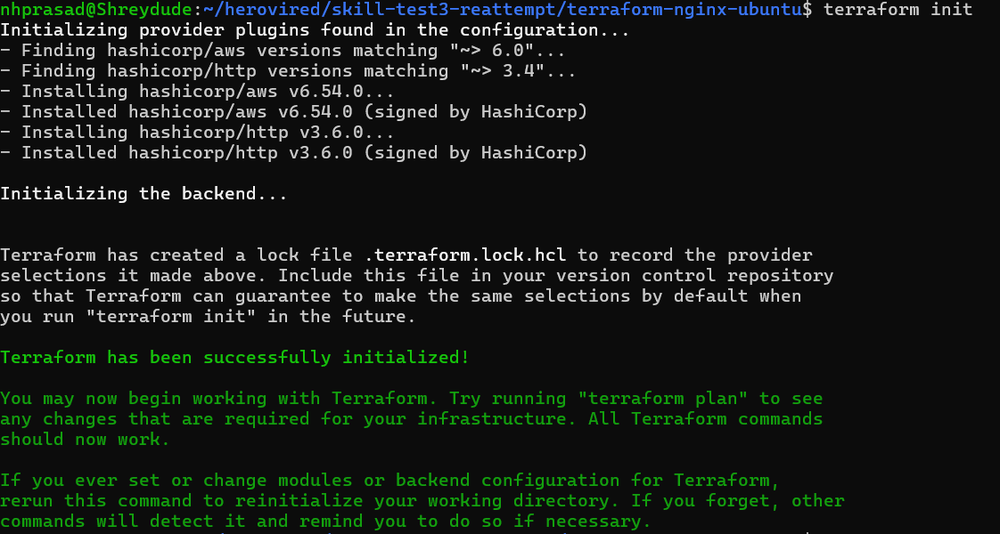
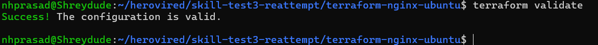
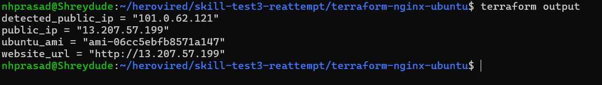
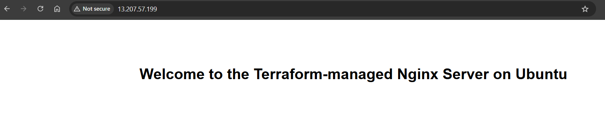
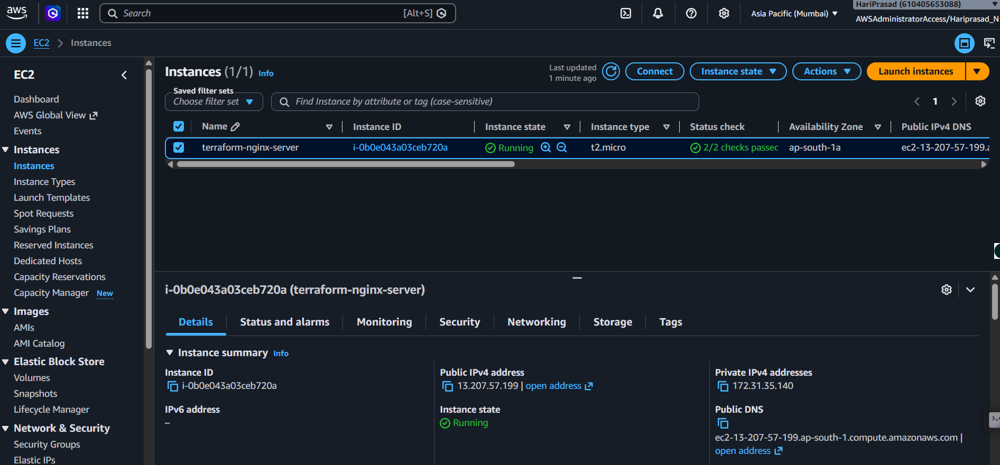
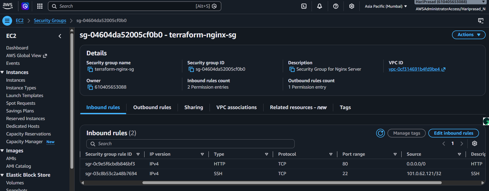
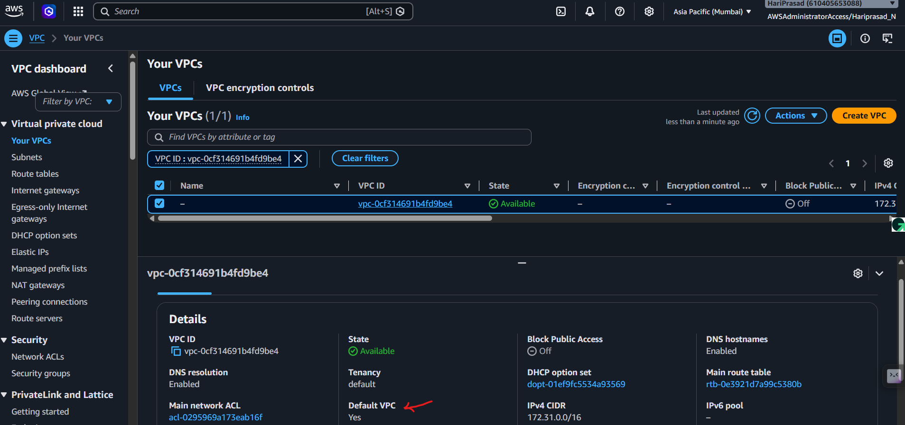
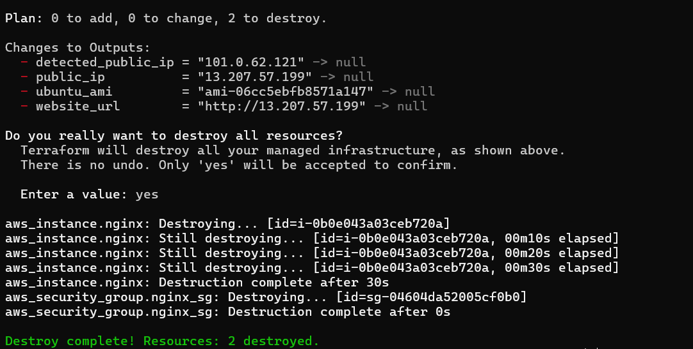
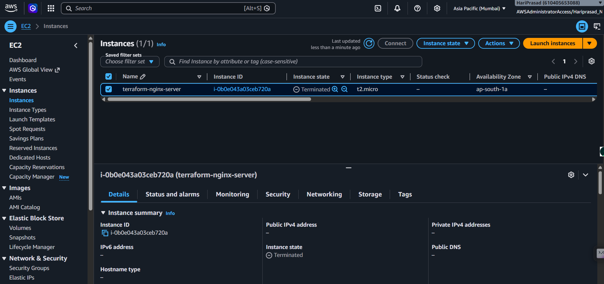

# EC2 Nginx Deployment using Terraform

## Overview

This project demonstrates Infrastructure as Code (IaC) using Terraform to provision an Ubuntu 20.04 EC2 instance in the default AWS VPC. During provisioning, Nginx is installed automatically using a user_data script, and the default web page is replaced with a custom HTML page.

---

## Architecture

```
Internet
    │
    ▼
Security Group
├── SSH (22) → My Public IP
└── HTTP (80) → 0.0.0.0/0
    │
    ▼
Ubuntu 20.04 EC2 (t2.micro)
    │
user_data
    │
Install Nginx
    │
Custom HTML Page
```

---

## Resources Created

- AWS EC2 Instance (Ubuntu 20.04 LTS)
- Security Group
- Nginx Web Server

---

## Security

- SSH (22) is restricted to the deployer's current public IP, which is detected automatically during deployment.
- HTTP (80) is open to the Internet to allow browser access.

---

## Enhancements

Compared to the basic assignment requirements, the following best practices were implemented:

- Automatically discovers the latest Ubuntu 20.04 LTS AMI.
- Automatically detects the deployer's current public IP for SSH access.
- Restricts SSH access to a single IP address instead of `0.0.0.0/0`.
- Uses Terraform outputs for easy access to deployment details.

---

## Terraform Commands

```bash
terraform init
terraform fmt
terraform validate
terraform plan
terraform apply
terraform destroy
```

---

## Outputs

Terraform displays:

- EC2 Public IP
- Website URL
- Ubuntu AMI ID
- Detected Public IP

---

## Screenshots

### 1. Terraform Initialization



---

### 2. Terraform Validation



---

### 3. Terraform Outputs



---

### 4. Nginx Home Page



---

### 5. EC2 Instance Running



---

### 6. Security Group Rules



---

### 7. Default VPC



---

### 8. Terraform Destroy



---

### 9. EC2 Successfully Removed



---

## Cleanup

All resources can be removed using:

```bash
terraform destroy
```

This removes:

- EC2 Instance
- Security Group

No infrastructure remains after cleanup.
